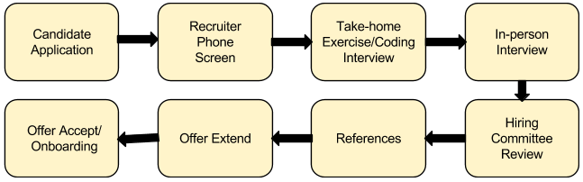

# Open Sourced Interview Process

- [Getting Started](#getting-started)
- [Interview Process and Timeline](#interview-process-and-timeline)
- [For Candidates - Applying to Cockroach Labs](#for-candidates---applying-to-cockroach-labs)
- [For Recruiters - Resources](#for-recruiters---resources)
- [Challenging Our Unconcious Bias](#challenging-our-unconscious-bias)
- [Exercise Based Interview Questions](#exercise-based-interview-questions)
- [Contributing to the Interview Process Guide](#contributing-to-the-interview-process-guide)

## Welcome to the Cockroach Labs Interview Process
At Cockroach Labs, we are exploring new ways to structure our interview process to create familiarity for candidates and account for bias, resulting in a better candidate experience and hiring decisions. Instead of asking questions based on past performance or hypothetical future situations, we focus on assessing the skills you’ll use in your role with exercise based interviews. 

**Why are we open sourcing the interview process?**

- **To help candidates feel prepared:** If you spend the time to research Cockroach Labs and our interview process, we will be thrilled.  We think that if candidates spend the time to prepare for engaging discussions with the team, they will be ready to do the same when they join the team! 

- **To usher in a new standard of interviewing and transparency:** We want to encourage founders, recruiters, and everyone involved in the hiring process to think outside the box regarding the interview process.  We want candidates to get a realistic preview of what’s to come in their role at Cockroach Labs by setting up relevant simulations and scenarios. We are always asking ourselves, “what else can we be doing to provide candidates with a process that is fair and inclusive?”

- **To collaborate.** Let’s challenge our bias *together*. Let’s all pledge to do better than we have before. We welcome feedback on our interview process and encourage anyone reading this to contribute your ideas to our process as well!

Learn more by reading our blog post, ‘[Exercise Based Interviewing at Cockroach Labs](https://www.cockroachlabs.com/blog/exercise-based-interviewing/).’

## Getting Started

The following content will provide both candidates and recruiters with valuable information. 

**For Candidates:**

- You will leave with a thorough understanding of the interview process at Cockroach Labs, along with visibility into real questions from our onsite interviews. Our recruiters will be happy to confirm which of these questions will be presented during the onsite interview. 

- Please note, around 10-20% of each interview is spent on a curve-ball question that we do not include in the exercises. While you can come prepared for a majority of the interview, we also like to see how you think on your feet.

**For Recruiters:**

- Leverage the Cockroach Labs interview process and questions for your company’s hiring process. If you would like access to the curveball questions or rubrics, please reach out direct to recruiting@cockroachlabs.com, and we will be happy to share them with you.

- Contributions to the Cockroach Labs Interview Process are welcomed and encouraged! Please see Contributing to the Interview Process Guide below. 

## Interview Process and Timeline

#### Overview

We aim to have our interview process take an average of 3 weeks from start to finish.  Between each step of the interview process, we ask for at most 3 business days for us to to make a decision, but at any point during the interview process, please feel comfortable reaching out to us for updates on your candidacy. 

Throughout our interview process, it is important to remember that after the Recruiter Phone Screen, the candidate's resume and the recruiter's notes will not be shared with the hiring team. This is one of the ways that we focus on the skills candidates show during the exercises, rather than their past experience. Learn more about this here: "[How We're Fighting Unconscious Bias](https://www.cockroachlabs.com/blog/fighting-unconscious-bias-cockroach-labs/)."

1. **Candidate Application:** Applicants receive an automated message from the Applicant Tracking System (in this case, [Greenhouse](https://www.greenhouse.io)) to confirm receipt of their application. The note thanks them for submitting their information and contains a Cockroach Labs Company Guide that gives applicants an inside look into the company culture.

2. **Candidate Application Review:** The recruiter for the position will do the first round of evaluations and review application submissions. If more information is required, a member of the team will reach out to the applicant directly. Candidates that are disqualified at this stage will be notified by the recruiter.

3. **Recruiter Phone Screen:** If the candidate qualifies for the role, the recruiter will send an availability request for a 30-minute call to explore their background and experience. Depending on the outcome of the screening call, the candidate will either be rejected or proceed to a take-home exercise or a technical phone interview.

4. **Take-home Exercise and/or Phone Interview**

    - **Take-home Exercise:** The take-home exercise typically takes 1-2 hours to complete and allows the hiring manager or a memeber of the team to review a candidate’s skills before proceeding to the next step of the hiring process. The take-home exercise replaces one onsite interview, equaling one hour of engagement.  

    - **Phone Interview:** The 1-hour phone interview with a member of the team covers skills related to the specific role or to review the take-home exercise. For technical phone interviews, we use Google Hangouts and [coderpad.io](http://coderpad.io/) and cover coding and debugging, algorithms, and data structures.

5. **In-person Interviews:** The next step in the interview process is an onsite interview. The onsite interview team consists of people that would be on the candidate's direct team and people on cross-functional teams too. The recruiter will share an overview of who the candidate will be meeting with. The interview itself has 4-5 exercise based interviews, with a break in the middle for lunch with a member of the team. Each session runs an hour long, including lunch, which is a time for candidates to take a break, relax, and get a feel for our culture at Cockroach Labs. 

6. **Candidate Survey:** Once the candidate comes onsite, the recruiter will send the candidate a link to complete our candidate survey.  By filling out this short 2-minute survey, candidates help us iterate on our interview process.  

7. **Hiring Committee Review:** After the onsite interview is complete, feedback from the interview process is shared across the interview team. Interview team members review the feedback and independently reach a decision of hire/no-hire based on the comprehensive feedback. At the HC review, the interview team reaches a consensus on whether to reject the candidate or proceed with reference calls.

8. **Reference Calls:** The recruiting team will make reference calls for promising candidates. At a minimum, two reference calls will be completed.  One should be a candidate's manager and the other someone someone who has worked directly with the candidate and can speak to their past work. 

9. **Final Review:** After successful reference calls, the recruiter submits the employee packet to the CEO and Hiring Manager for final approval.

10. **Offer Extend:** The recruiter will reach out to the candidate to schedule time to connect and extend the formal offer. Initially, this is done verbally but is always followed by the written offer as described in the section on preparing offers. The Hiring Manager and interview team follows-up to answer any questions that the candidate may have, which will hopefully lead to the candidate accepting the offer. While we would love to know whether or not you'd like to accept an offer from us in 3 days as well, we are happy to extend offer deadlines up to one month, so that you can make the best decision for you and your family. 

11. **Offer Accept/Onboarding:** If the candidate accepts the offer, the onboarding process begins. 

## For Candidates - Applying to Cockroach Labs

The best way to apply for positions with Cockroach Labs is directly through our careers page, where we list all of our open roles. If there is not a role open that looks interesting to you, we encourage you to reach out to us directly at recruiting@cockroachlabs.com and check back with us in the future as we continue to grow. 

To apply to Cockroach Labs:

1. Go to our [careers page](https://www.cockroachlabs.com/careers/).

2. Check out our mission, core values, and benefits on your way to our list of [open roles](https://www.cockroachlabs.com/careers/#jobs). 

3. Click on the team you'd like to join, choose the job you'd like to do, and review the description of the role.

4. If the role sounds interesting to you, fill out the application form at the bottom of the page, then click the "Submit Application" button.  

## For Recruiters - Resources

These files provide a deep-dive into the various stages of the interview process. It is important that recruiters tailor each stage to the position they are hiring for. Stages included: 

- [Job Descriptions](JobDescriptions.md)

- [Recruiter Phone Screen](RecruiterPhoneScreen.md)

- [Structuring the Interview](StructuringtheInterview.md)

- [Interview Feedback and Scoring](InterviewFeedbackandScoring.md)

- [Rejecting Applicants](RejectingApplicants.md)

- [Candidate Feedback Survey](CandidateFeedbackSurvey.md)

## Challenging our Unconscious Bias

In the effort of building a diverse workforce, at Cockroach Labs, we ask the question "are we missing strong candidates because of preconceptions or unconscious biases of the interviewer?" To challenge our bias, we have committed to:

1. Exercise based interviewing

2. Removing resumes

3. Expectations based job descriptions

Our hypothesis is that a structured and fair process means better decisions. We understand that it is impossible to eliminate all biases, so we want to make sure that we are aware of them and challenge them in whatever ways we can.

## Exercise Based Interview Questions

The purpose of an interview is to obtain information about a candidate in order to predict future performance. To accomplish this, we rely on Exercise-Based Interviewing. Exercise based interviews can include case studies, group exercises involving role play or discussions, individual exercises, or presentations. They allow for our interviewers to witness the direct application of a candidate’s abilities to competencies required for the role. Rather than guess if a candidate can do the job based on their answers to behavioral questions, we ask for candidates to show. During the interview, candidates are asked to complete exercises that are similar to the initiatives they would complete when actually working in the position on a day to day basis.

For engineering positions, we use coding and system design questions. For non-tech, we use job-based simulations in the form of case studies, individual exercises, and/or presentations. 

For more information about the different exercises we use in our interview process, please review the different department areas. 

- [Administrative Exercises](AdministrativeExercises.md)

- [Documentation Exercises](DocumentationExercises.md)

- [Engineering Exercises](EngineeringExercises.md)

- [Human Resources Exercises](HumanResourcesExercises.md)

- [Marketing Exercises](MarketingExercises.md)

- [Product Exercises](ProductExercises.md)

- [Product Design Exercises](ProductDesignExercises.md)

- [Recruiting Exercises](RecruitingExercises.md)

- [Sales Exercises](SalesExercises.md)

- [Technical Support Exercises](TechnicalSupportExercises.md)

## Contributing to the Interview Process Guide

If you’d like to contribute an interview exercise, please follow the template below, then either submit a pull request on the correct file for the departments listed or email it to recruiting@cockroachlabs.com to be added to the file. Please note, if they department file does not exists, email recruiting@cockroachlabs.com so we can create it for you. 

**Interview Exercise Template:** 

**Title:** 

- **Overview:** 

- **Set-up:** 

- **Part 1:** 

- **Part 2:** 

- **Considerations:** 

- **Follow-up Question:** 

- **Prompts (if any)**

- **[Not included] Curveball Question:** The curveball portion should be an extension of the interview that shows how the candidate thinks on their feet. This portion is not shared with candidates as we want to evaluate how they respond to a problem to find a solution.
