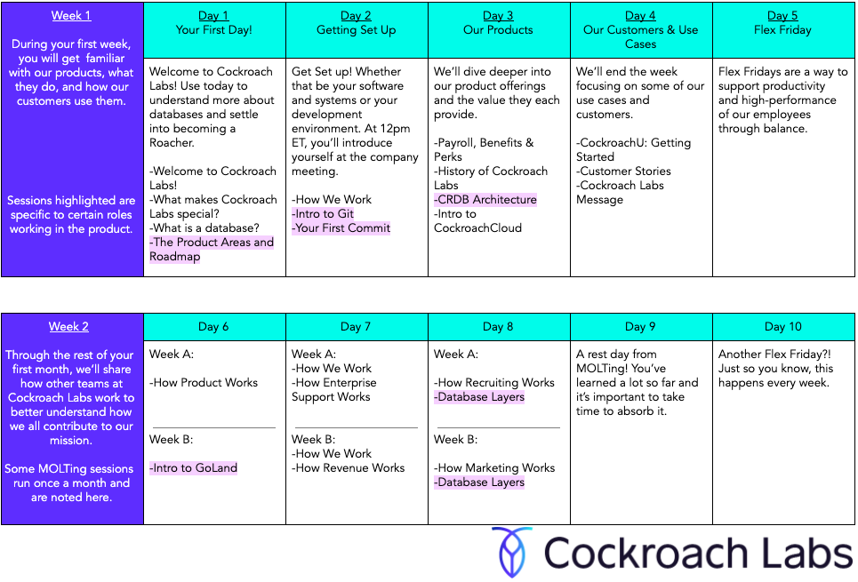

## Your First Weeks at Cockroach Labs

In order to make sure that you can ramp up at a reasonable pace, we've developed MOLTing, or Month of Learning Things, to help you get familiar with Cockroach Labs and our processes as you settle into your role. As it turns out, molting is also the process that baby cockroaches go through to become an adult cockroach, mirroring out onboarding process.

## Onboarding at Cockroach Labs

At Cockroach Labs, we use our onboarding period to focus on getting new Roachers up to speed with Cockroach Labs and our product, CockroachDB. 

On Week 1, we start off understanding how we operate at Cockroach Labs and why this opportunity to build a database is special. Over the course of the week, we begin to understand a bit more about CockroachDB. If you’re unfamiliar with what a database is, we’ll start you off there, but if you’ve worked with databases before, we’ll share a deep dive into how ours works.

On your second and fourth weeks, we give you an introduction into how other teams work at Cockroach Labs. The goal is to give you insight into what others teams do to support our mission of Make Data Easy. It’s a way to highlight work and roles that you may be unfamiliar with but also share ways that you can collaborate and support those departments.

We onboard new hires every 2 weeks to keep a consistent onboarding cycle and to have new hires join with others. We know that ramping up at a new company takes time, so we encourage you to use your first month to learn, digest and ask questions.

**Resources**
- Learn about Welcome Docs [Welcome Docs: Getting Started at Cockroach Labs](https://www.cockroachlabs.com/blog/onboarding-starter-projects/).
